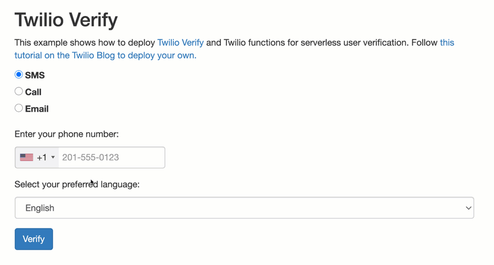

# Serverless Twilio Verify

This code shows how to use [Twilio Verify](https://twilio.com/docs/verify/api) and [Twilio Functions](https://www.twilio.com/console/functions/manage) for a serverless phone verification solution.

[Follow the tutorial to deploy your own on the Twilio Blog](https://www.twilio.com/blog/serverless-phone-verification). **Check out a [demo on Glitch](https://atlantic-vault.glitch.me/)**.



## Running this project

Clone the repo and copy `.env.example` to `.env`. Fill in the environment variables with your own Twilio Account SID, Auth Token, and Verify Service SID. 

Run the project with npm:

```
npm start
```

## License

MIT